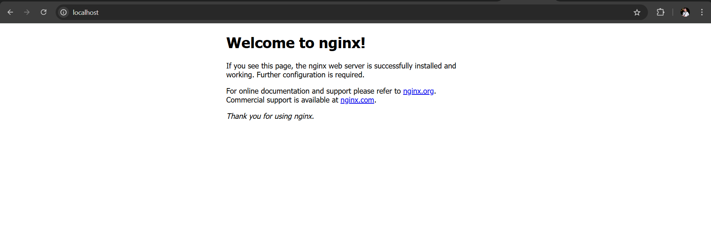
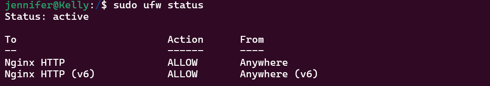

# Projeto Prático de Linux PB - NOV 2024 | Trilha DevSecOps

## Prática reaLizada no programa de bolsas da Compass UOL PB 2024 | Trilha DevSecOps

Esta documetação detalha a criação de um sistema prático e automatizado para monitorar o estado de um servidor Nginx em execução em um ambiente Linux configurado no Windows Subsystem for Linux (WSL). A iniciativa busca demonstrar habilidades essenciais, como configuração de ambiente, criação de scripts para automação, e utilização de cron para agendamentos periódicos. Este projeto é útil tanto para aprendizado quanto para aplicação real em cenários de administração de sistemas.

## Índice

- [Projeto Prático de Linux PB - NOV 2024 | Trilha DevSecOps](#projeto-pr-tico-de-linux-pb-nov-2024-trilha-devsecops)
  * [Prática reaLizada no programa de bolsas da Compass UOL PB 2024 | Trilha DevSecOps](#pr-tica-realizada-no-programa-de-bolsas-da-compass-uol-pb-2024-trilha-devsecops)
  * [Pré-requisitos](#pr-requisitos)
  * [Objetivos](#objetivos)
  * [Índice](#índice)
- [Prática](#pr-tica)
    + [1. Criar o ambiente Linux no Windows usando WSL](#1-criar-o-ambiente-linux-no-windows-usando-wsl)
      - [1.1. Habilitar o WSL no Windows](#11-habilitar-o-wsl-no-windows)
      - [1.2. Instalar a Distribuição Ubuntu](#12-instalar-a-distribui-o-ubuntu)
      - [1.3. Confirmar Configuração do WSL](#13-confirmar-configura-o-do-wsl)
    + [2. Configurar o Servidor Nginx](#2-configurar-o-servidor-nginx)
      - [2.1. Instalar o servidor Nginx](#21-instalar-o-servidor-nginx)
      - [2.2. Testar o servidor Nginx](#22-testar-o-servidor-nginx)
    + [3. Configuração de permissões e criação de logs](#3-configura-o-de-permiss-es-e-cria-o-de-logs)
      - [3.1. Criar Diretórios e Arquivos de Log](#31-criar-diret-rios-e-arquivos-de-log)
    + [4. Criar o Script de Monitoramento](#4-criar-o-script-de-monitoramento)
      - [4.1. Crie o diretório para armazenar o script](#41-crie-o-diret-rio-para-armazenar-o-script)
      - [4.2. Tornar o Script Executável](#42-tornar-o-script-execut-vel)
    + [5. Automatizar a Execução do Script](#5-automatizar-a-execu-o-do-script)
      - [5.1. Editar o Crontab](#51-editar-o-crontab)
      - [5.2. Adicionar verificação de 5 em 5 minutos no Crontab](#52-adicionar-verifica-o-de-5-em-5-minutos-no-crontab)

## Pré-requisitos
- Windows 10 ou superior com suporte ao WSL (Windows Subsystem for Linux).
- WSL Ubuntu 20.04 LTS ou superior

## Objetivos
- Criar um subsistema do Ubuntu 20.04 ou superior no Windows utilizando o WSL do Windows;
- Subir um servidor Nginx e mantê-lo online e rodando;
- Desenvolver um script que valide se o serviço está online e envie o resultado da validação para um diretório pré-definido;
- Conter no script - Data Hora + Nome do Serviço + Status + Mensagem Personalizada de ONLINE ou OFFLINE; 
- Automatizar a execução do script para gerar 2 arquivos de saída, 1 para o serviço ONLINE e outro para o serviço OFFLINE; 
- Preparar a execução automatizada do script a cada 5 minutos.

    
## Prática

### 1. Criar o ambiente Linux no Windows usando WSL
#### 1.1. Habilitar o WSL no Windows
**1 .** Abra o Prompt de Comando (CMD) ou o PowerShell como administrador.
**2 .** Execute o comando abaixo para habilitar o WSL:
```bash
wsl --install
```
Este comando instala o WSL e o subsistema Linux padrão.
**3 .** Reinicie o computador, caso solicitado.

#### 1.2. Instalar a Distribuição Ubuntu
**1 .** No terminal, liste as distribuições disponíveis executando o comando:
```bash
wsl --list --online
```
Você verá algo como:


**2 .** Instale o Ubuntu 20.04 ou superior:
```bash
wsl --install -d Ubuntu-20.04
```
**3 .** Após a instalação, o terminal abrirá o Ubuntu automaticamente. Configure um nome de usuário e senha.

#### 1.3. Confirmar Configuração do WSL
**1 .** Para verificar se o WSL e o Ubuntu estão configurados corretamente, execute:
```bash
wsl --list --verbose
```
A saída deve mostrar a distribuição com o estado Running e a versão WSL 2.

### 2. Configurar o Servidor Nginx
#### 2.1. Instalar o servidor Nginx
**1 .** No terminal do Ubuntu, para atualizar o sistema e seus pacotes, execute:
```bash
sudo apt update && sudo apt upgrade
```
**2 .** Instale o servidor Nginx:
```bash
sudo apt install nginx
```
**3 .** Verifique o status do serviço:
```bash
sudo systemctl status nginx
```
Status esperado: active (running).
**4 .** Se o serviço estiver inativo, execute:
```bash
sudo systemctl start nginx
```
Esse comando inicializará o serviço, para confirmar, verifique novamente o status.

**5 .** Habilite o Nginx para iniciar automaticamente ao reiniciar o sistema:
```bash
sudo systemctl enable nginx
```
#### 2.2. Testar o servidor Nginx
**1 .** Agora que o Nginx está rodando, você pode verificar se o servidor está online. Abra um navegador web e acesse:
```bash
http://localhost
```


Se o endereço web não retornou esse resultado da imagem pode ser que o servidor esteja com problemas no firewall.
O firewall do sistema pode bloquear a porta 80 (HTTP) ou outras portas que o Nginx precise usar. É importante liberar essas portas para que o servidor fique acessível.

**2 .** Execute o comando:
```bash
sudo ufw allow 'Nginx HTTP'
sudo ufw enable
```
O comando ufw allow libera as conexões externas para o serviço Nginx

**3 .** Execute o seguinte comando no terminal para verificar se o firewall está ativo:
```bash
sudo ufw status
```


Se você está vendo "To: nginx HTTP, Action: Allow, From: Anywhere", como na imagem, isso indica que o tráfego HTTP (porta 80) está online e permitido no seu firewall para qualquer endereço de origem.

### 3. Configuração de permissões e criação de logs
#### 3.1. Criar Diretórios e Arquivos de Log
**1 .** Antes de criar o script, configure os diretórios e arquivos onde os registros serão salvos.

**2 .** Execute o comando a seguir para criar o diretório que armazenará os arquivos:


**3 .** Configure as permissões na pasta /var/log/nginx_monitor para criar logs personalizados


**4 .** Crie os arquivos de log no diretório criado anteriormente
```bash
sudo touch online.log
```
```bash
sudo touch offline.log
```
### 4. Criar o Script de Monitoramento
#### 4.1. Crie o diretório para armazenar o script 
**1 .** Execute o comando dentro do diretório nginx_monitor/
```bash
sudo mkdir scripts
```
**2 .** Crie o script verificar_status.sh dentro do diretório scripts:
```bash
sudo nano verificar_status.sh
```
**3 .** O comando anterior irá direcioná-lo para o editor de texto "nano", escreva o script que verifica o estado atual do servidor e retorna Data Hora + Nome do Serviço + Status + Mensagem Personalizada de ONLINE ou OFFLINE para seus respectivos arquivos log.

```bash
#!/bin/bash

# Variáveis para os arquivos de log ONLINE e OFFLINE
ONLINE_LOG="/var/log/nginx_monitor/logs/online.log"
OFFLINE_LOG="/var/log/nginx_monitor/logs/offline.log"

# Variável que armazena o nome do serviço
SERVICO="Nginx"

# Variável que armazena data e hora atuais
DATA_HORA=$(date "+%Y-%m-%d %H:%M:%S")

# Verifica o status do serviço e encaminha mensagem de status para os arquivos de log ONLINE e OFFLINE
if systemctl is-active --quiet nginx; then
    STATUS="ONLINE"
    MENSAGEM="$DATA_HORA | Serviço: $SERVICO | Status: $STATUS | Mensagem: O serviço está funcionando normalmente."
    echo "$MENSAGEM" >> "$ONLINE_LOG"
else
    STATUS="OFFLINE"
    MENSAGEM="$DATA_HORA | Serviço: $SERVICO | Status: $STATUS | Mensagem: O serviço está fora do ar."
    echo "$MENSAGEM" >> "$OFFLINE_LOG"
fi
```

Salve Crt + o, e feche o arquivo Crt + x.

#### 4.2. Tornar o Script Executável
**1 .** Acesse o diretório onde o script foi salvo e torne o script executável:
```bash
sudo chmod +x verificar_status.sh
```
**2 .** Execute o script manualmente para testar:
```bash
./monitor_nginx.sh
```

**3 .** Verifique os arquivos de log.

### 5. Automatizar a Execução do Script
Para automatizar o script de monitoramento para rodar a cada 5 minutos, configuraremos o crontab.
#### 5.1. Editar o Crontab
**1 .** Abra o editor do crontab:
```bash
sudo crontab -e
```
Se for a primeira vez que você está abrindo o crontab, será solicitado que escolha um editor de texto. Recomendo o nano por ser mais simples. 

#### 5.2. Adicionar verificação de 5 em 5 minutos no Crontab

O comando crontab no Linux é um serviço de agendamento de tarefas automáticas para os usuários e o sistema. 
Ele permite que um comando, programa ou script seja agendado para um determinado dia, mês, ano e hora. É muito usado em tarefas que precisam ser executadas a cada hora, dia ou qualquer outro período, de forma recorrente.

Ele manipula o "cron", que é o serviço responsável por executar esses trabalhos agendados

A sintaxe de um cron é:
```scss
* * * * * comando_a_ser_executado
- - - - -
| | | | |
| | | | +--- Dia da semana (0 - 7) (Domingo = 0 ou 7)
| | | +----- Mês (1 - 12)
| | +------- Dia do mês (1 - 31)
| +--------- Hora (0 - 23)
+----------- Minuto (0 - 59)

```
Vamos, então, à configuração do cron para a nossa tarefa.

**1 .** No editor do crontab, role até o final e adicione a seguinte linha:
```bash
*/5 * * * * /var/log/nginx_monitor/scripts/verificar_status.sh
```
No editor nano, salve o arquivo Crt + o, e feche-o, Crt + x.
Essa configuração realiza a cada 5 minutos a execução do arquivo verificar_status.sh que por sua vez envia as mensagens de log para os respectivos arquivos .log, a depender do status do servidor, ONLINE ou OFFLINE.

A baixo estão resultados de logs para o serviço online e offline.

- Logs quando o serviço está ONLINE:


- Logs quando o serviço está OFFLINE:


##

- [Projeto Prático de Linux PB - NOV 2024 | Trilha DevSecOps](#projeto-pr-tico-de-linux-pb-nov-2024-trilha-devsecops)
  + [Prática reaLizada no programa de bolsas da Compass UOL PB 2024 | Trilha DevSecOps](#pr-tica-realizada-no-programa-de-bolsas-da-compass-uol-pb-2024-trilha-devsecops)
  + [Pré-requisitos](#pr-requisitos)
  + [Objetivos](#objetivos)
  * [Índice](#índice)
- [Prática](#pr-tica)
    + [1. Criar o ambiente Linux no Windows usando WSL](#1-criar-o-ambiente-linux-no-windows-usando-wsl)
      - [1.1. Habilitar o WSL no Windows](#11-habilitar-o-wsl-no-windows)
      - [1.2. Instalar a Distribuição Ubuntu](#12-instalar-a-distribui-o-ubuntu)
      - [1.3. Confirmar Configuração do WSL](#13-confirmar-configura-o-do-wsl)
    + [2. Configurar o Servidor Nginx](#2-configurar-o-servidor-nginx)
      - [2.1. Instalar o servidor Nginx](#21-instalar-o-servidor-nginx)
      - [2.2. Testar o servidor Nginx](#22-testar-o-servidor-nginx)
    + [3. Configuração de permissões e criação de logs](#3-configura-o-de-permiss-es-e-cria-o-de-logs)
      - [3.1. Criar Diretórios e Arquivos de Log](#31-criar-diret-rios-e-arquivos-de-log)
    + [4. Criar o Script de Monitoramento](#4-criar-o-script-de-monitoramento)
      - [4.1. Crie o diretório para armazenar o script](#41-crie-o-diret-rio-para-armazenar-o-script)
      - [4.2. Tornar o Script Executável](#42-tornar-o-script-execut-vel)
    + [5. Automatizar a Execução do Script](#5-automatizar-a-execu-o-do-script)
      - [5.1. Editar o Crontab](#51-editar-o-crontab)
      - [5.2. Adicionar verificação de 5 em 5 minutos no Crontab](#52-adicionar-verifica-o-de-5-em-5-minutos-no-crontab)

